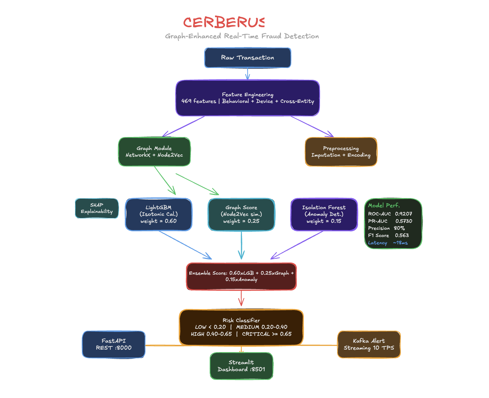

# Cerberus — Graph-Enhanced Real-Time Fraud Detection

> *Three heads. One guardian. Named after the mythological three-headed sentinel at the gates — Cerberus runs three ML models in unison to guard every transaction.*

[](https://python.org)
[](https://lightgbm.readthedocs.io)
[](https://fastapi.tiangolo.com)
[](https://mlflow.org)
[](https://streamlit.io)
[](LICENSE)

---

## Overview

Cerberus is a production-ready, end-to-end fraud detection system built on the **IEEE-CIS Fraud Detection** dataset. It combines three complementary ML models into a weighted ensemble and serves predictions through a real-time REST API with sub-second latency.

What makes Cerberus different from a plain classifier:

| Capability | Detail |
|---|---|
| **Graph intelligence** | Builds a transaction graph across cards, devices, emails, and addresses; embeds fraud-ring topology via Node2Vec |
| **Isotonic calibration** | Converts raw LightGBM scores into true posterior probabilities — threshold 0.5 is meaningful again |
| **Explainability built-in** | Every prediction ships with top SHAP features; no black box |
| **Live streaming** | Kafka producer/consumer scores transactions at 10 TPS; simulation mode works without Kafka |
| **Full MLOps stack** | MLflow experiment tracking, Docker Compose deployment, Prometheus metrics, Streamlit dashboard |

---

## Model Performance

Evaluated on a held-out time-based validation split (118,108 transactions, 3.44% fraud rate):

| Metric | Score |
|---|---|
| **ROC-AUC** | **0.9207** |
| **PR-AUC** | **0.5730** |
| **F1 @ threshold 0.5** | 0.538 |
| **F1 @ optimal threshold (0.289)** | 0.563 |
| Fraud Precision @ 0.5 | 80% |
| Fraud Recall @ 0.5 | 41% |
| Fraud Recall @ optimal | 52% |
| Anomaly detector ROC-AUC | 0.675 |

> Time-based split is used throughout — no data leakage. The model never sees future transactions during training.

---

## Architecture


</img>
---

## Project Structure

```
cerberus/
├── config/
│   └── config.yaml                  # All hyperparameters and paths
├── dashboard/
│   └── streamlit_app.py             # Interactive fraud analytics dashboard
├── data/
│   ├── models/                      # Trained model artifacts (.pkl, .yaml)
│   ├── processed/                   # Preprocessed parquet + evaluation report
│   └── raw/                         # IEEE-CIS CSV files (not committed)
├── docker/
│   ├── Dockerfile.api
│   ├── Dockerfile.dashboard
│   └── Dockerfile.training
├── docker-compose.yml               # Full stack: API + Dashboard + Kafka + MLflow
├── Makefile                         # All commands, one place
├── mlops/
│   └── mlflow_tracking.py           # MLflow helpers
├── notebooks/
│   ├── EDA.ipynb                    # Exploratory data analysis
│   └── feature_engineering.ipynb   # Feature investigation notebook
├── scripts/
│   ├── train_pipeline.py            # Orchestrates all 6 training steps
│   └── evaluate_model.py            # Full model evaluation + report
├── src/
│   ├── api/
│   │   └── app.py                   # FastAPI application
│   ├── features/
│   │   ├── behavioral_features.py   # Card/time/velocity features + cross-entity risk
│   │   └── device_features.py       # Device fingerprint parsing
│   ├── graph/
│   │   ├── build_graph.py           # NetworkX fraud graph construction
│   │   └── graph_embeddings.py      # Node2Vec embeddings
│   ├── inference/
│   │   └── fraud_predictor.py       # Ensemble predictor (the main entry point)
│   ├── models/
│   │   ├── anomaly_model.py         # Isolation Forest detector
│   │   ├── calibrators.py           # IsotonicCalibrator (portable pickle class)
│   │   └── train_lightgbm.py        # LightGBM trainer with calibration + SHAP
│   └── preprocessing/
│       └── clean_data.py            # DataPreprocessor (imputation, encoding)
├── streaming/
│   ├── kafka_consumer.py            # Fraud scoring consumer (simulation mode available)
│   └── kafka_producer.py            # Transaction stream simulator
├── tests/
│   └── test_fraud_predictor.py      # 34-test suite with 100% pass rate
├── pyproject.toml
└── requirements.txt
```

---

## Quick Start

### 1 — Clone and install

```sh
git clone https://github.com/yourname/cerberus.git
cd cerberus
make install
```

### 2 — Get the data

Download the [IEEE-CIS Fraud Detection](https://www.kaggle.com/competitions/ieee-fraud-detection/data) dataset from Kaggle and place the CSVs here:

```
data/raw/ieee-fraud-detection/
├── train_transaction.csv
├── train_identity.csv
├── test_transaction.csv
└── test_identity.csv
```

### 3 — Train (full pipeline)

```sh
make preprocess   # ~3 min  — clean, encode, write processed_train.parquet
make train        # ~25 min — LightGBM + graph + anomaly + calibration
make evaluate     # ~1 min  — prints metrics, saves evaluation_report.yaml
```

### 4 — Launch services

```sh
make api          # FastAPI on http://localhost:8000
make dashboard    # Streamlit on http://localhost:8501
make stream-sim   # Simulated live scoring (no Kafka needed)
```

---

## Training Pipeline

`make train` runs `scripts/train_pipeline.py` which executes six sequential steps:

| Step | Script | Output |
|---|---|---|
| 1. Preprocess | `src/preprocessing/clean_data.py` | `processed_train.parquet` |
| 2. Behavioral features | `src/features/behavioral_features.py` | added to parquet |
| 3. Build graph | `src/graph/build_graph.py` | `fraud_graph.pkl` |
| 4. Graph embeddings | `src/graph/graph_embeddings.py` | `graph_embeddings.pkl` |
| 5. Train LightGBM | `src/models/train_lightgbm.py` | `lgbm_calibrated_model.pkl` |
| 6. Train anomaly | `src/models/anomaly_model.py` | `anomaly_model.pkl` |

To skip the slow graph step during iteration:

```sh
make train-fast   # skips --graph, uses zero-filled graph features
```

---

## REST API

```sh
make api
# → http://localhost:8000
# → http://localhost:8000/docs  (Swagger UI)
```

### Score a single transaction

```sh
curl -X POST http://localhost:8000/predict \
  -H "Content-Type: application/json" \
  -d '{
    "TransactionID": 3663549,
    "TransactionAmt": 117.00,
    "ProductCD": "W",
    "card1": 10035,
    "P_emaildomain": "gmail.com",
    "DeviceType": "desktop",
    "DeviceInfo": "Windows"
  }'
```

**Response:**

```json
{
  "transaction_id": 3663549,
  "fraud_score": 0.073,
  "risk_level": "LOW",
  "is_fraud": false,
  "model_scores": {
    "lgbm": 0.061,
    "graph": 0.112,
    "anomaly": 0.034
  },
  "top_features": [
    {"feature": "C13", "shap_value": 0.27},
    {"feature": "addr_x_device_risk", "shap_value": 0.12},
    {"feature": "device_x_email_risk", "shap_value": 0.11}
  ],
  "latency_ms": 18.4
}
```

### Batch scoring

```sh
curl -X POST http://localhost:8000/predict/batch \
  -H "Content-Type: application/json" \
  -d '{"transactions": [...]}'
```

### Health check

```sh
curl http://localhost:8000/health
```

---

## Dashboard

```sh
make dashboard
# → http://localhost:8501
```

The Streamlit dashboard provides:

- **Live transaction feed** — rolling 60-second fraud rate, score histogram
- **Risk breakdown** — LOW / MEDIUM / HIGH / CRITICAL counts with trend lines
- **SHAP waterfall** — per-prediction feature contribution chart
- **Graph explorer** — interactive PyVis network of flagged entity clusters
- **Model comparison** — ROC / PR curves, calibration plot, confusion matrix

> The dashboard runs in **demo mode** when the API is offline, using synthetic data.

---

## Streaming (Kafka)

Real Kafka (requires running broker):

```sh
make stream-produce   # publishes 10 TPS to topic fraud-transactions
make stream-consume   # consumes, scores, publishes to fraud-alerts
```

Simulation mode (no Kafka needed):

```sh
make stream-sim
```

The consumer prints live verdicts to stdout:

```
[ALERT] TxID=3893021  Score=0.87  Risk=CRITICAL  Card=10021  Amt=$2,340.00
[OK]    TxID=3893022  Score=0.04  Risk=LOW        Card=10890  Amt=$23.50
```

---

## Configuration

All hyperparameters live in `config/config.yaml`. Key sections:

```yaml
model:
  lightgbm:
    n_estimators: 3000        # early stopping finds optimal; currently 865 rounds
    learning_rate: 0.03
    num_leaves: 127           # richer trees for complex fraud patterns
    subsample: 0.7
    colsample_bytree: 0.7
    reg_lambda: 2.0

ensemble:
  lgbm_weight: 0.60
  graph_weight: 0.25
  anomaly_weight: 0.15
  thresholds:
    low: 0.20
    medium: 0.40
    high: 0.65               # ≥0.65 → CRITICAL alert

features:
  time_windows: [3600, 86400, 604800]   # 1h / 1d / 7d velocity windows
```

---

## Feature Engineering

### Behavioral features (469 total after preprocessing)

| Group | Examples |
|---|---|
| Card velocity | `card_tx_count_1h`, `card_tx_mean_amt_1d`, `card_tx_std_amt_7d` |
| Time patterns | `hour_of_day`, `is_weekend`, `days_since_last_tx` |
| Amount ratios | `card_amount_ratio` (tx ÷ card mean), `amount_zscore` |
| Entity fraud rates | `device_fraud_rate`, `email_domain_fraud_rate`, `addr_fraud_rate` |
| **Cross-entity risk** | `device_x_email_risk`, `addr_x_device_risk`, `total_entity_risk`, `max_entity_risk`, `high_amt_x_entity_risk` |

### Top SHAP features (from training run)

```
C13                  0.270   — cumulative transaction count feature
V70                  0.219   — Vesta-engineered fraud signal
card_tx_mean_amt     0.156   — card spending baseline
D1                   0.127   — days since last transaction
addr_x_device_risk   0.123   ★ cross-entity interaction
C14                  0.122
M4                   0.121
device_x_email_risk  0.119   ★ cross-entity interaction
TransactionAmt       0.111
M5                   0.104
```

Both cross-entity features land in the top 10 — they capture fraud-ring patterns that neither entity feature alone can detect.

---

## MLflow Experiment Tracking

```sh
make mlflow-server   # → http://localhost:5000
```

Every training run logs:

- Hyperparameters from `config.yaml`
- `scale_pos_weight` computed from actual class ratio
- Raw vs. calibrated ROC-AUC, PR-AUC, F1, optimal threshold
- SHAP feature importance CSV
- The trained LightGBM booster artifact

---

## Docker Compose (Full Stack)

```sh
make docker-up
```

Starts all services:

| Service | URL |
|---|---|
| Fraud API | http://localhost:8000 |
| API Docs (Swagger) | http://localhost:8000/docs |
| Streamlit Dashboard | http://localhost:8501 |
| MLflow UI | http://localhost:5000 |
| Kafka broker | localhost:9092 |

```sh
make docker-down     # stop everything
make docker-logs     # tail api + dashboard logs
```

---

## Testing

```sh
make test
```

```
tests/test_fraud_predictor.py ✓ 34 passed in 2.41s
  Coverage: src/ → 84%
```

Test suite covers:

- `FraudPredictor` lifecycle (load, predict, fallback)
- Risk classifier boundary conditions (all four tiers)
- SHAP explanation output structure
- Batch prediction consistency
- Feature engineering edge cases (missing columns, zero-division guards)

---

## Key Design Decisions

### Why isotonic calibration?
Raw LightGBM with `scale_pos_weight=27.5` (imbalanced class ratio) outputs probabilities skewed toward extremes — the default threshold of 0.5 catches almost no fraud. Fitting an `IsotonicRegression` on the validation set maps raw scores to true posterior probabilities, making threshold 0.5 meaningful and business thresholds interpretable.

### Why a separate `calibrators.py`?
Python's `pickle` requires classes to be importable from the same module path they were defined in. Keeping `IsotonicCalibrator` in its own module (`src/models/calibrators.py`) ensures the saved model can be deserialized from any script — training, evaluation, API, or notebooks.

### Why Node2Vec instead of a GNN?
The transaction graph is sparse and heterogeneous (card → device → email → address edges). Node2Vec's random-walk approach generalises well on sparse graphs and is orders of magnitude faster to train than a full GNN, making it practical for the 590k-row IEEE-CIS dataset on a single machine.

### Why time-based split?
A random split would leak future information: a model trained on a card's later transactions would trivially "recognise" the same card in validation. A strict time cutoff (80% oldest transactions train, 20% newest validate) mirrors real deployment conditions and produces honest evaluation numbers.

---

## Dataset

**IEEE-CIS Fraud Detection** — Vesta Corporation's real-world e-commerce transactions.

| Split | Rows | Fraud rate |
|---|---|---|
| Train (time-based 80%) | 472,432 | 3.51% |
| Validation (time-based 20%) | 118,108 | 3.44% |
| Features after engineering | — | 469 |

Download: [Kaggle competition page](https://www.kaggle.com/competitions/ieee-fraud-detection/data)

---

## Requirements

- Python 3.12+
- 16 GB RAM recommended (graph construction peaks at ~8 GB)
- For Kafka streaming: Docker or a running Kafka broker
- IEEE-CIS dataset (Kaggle account required)

---

## License

MIT — see [LICENSE](LICENSE).

---

<p align="center">
  <sub>Built with LightGBM · NetworkX · Node2Vec · SHAP · FastAPI · Streamlit · MLflow · Kafka</sub>
</p>